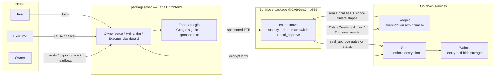
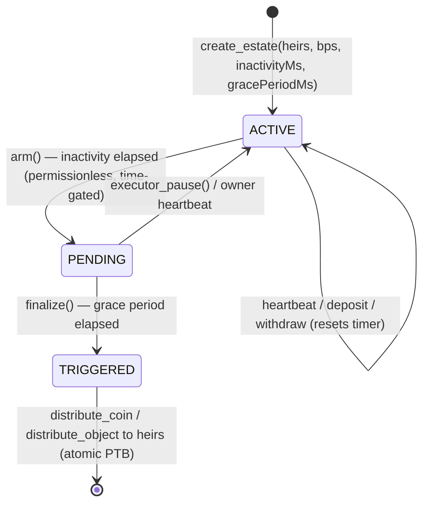

# Bequest Architecture

On-chain inheritance for crypto, built on Sui. An owner escrows assets into a shared `Estate`
with a dead-man's switch. If the owner goes inactive, the assets distribute atomically to named
heirs in a single PTB. The heir flow is built for Google sign-in (zkLogin) plus Enoki
sponsorship, with the sponsored digest treated as the final V2 proof gate.
Encrypted last-wishes live on Walrus and decrypt via Seal only after the inheritance triggers.

## System



## Lifecycle (the dead-man's switch)



While `ACTIVE`, `estate::seal_approve` denies decryption of the last-wishes blob. Once `TRIGGERED`,
`seal_approve` passes and heirs can decrypt the Walrus letter via Seal. Decryption is bound to
estate status, not to a key handed out in advance.

## Components

| Package | Role | Notes |
|---|---|---|
| `packages/move` | `estate.move` (custody + Clock-based ACTIVE→PENDING→TRIGGERED switch + `seal_approve` Seal policy) | Coin<T> held via dynamic field, objects via ObjectBag; heir bps sum to 10000, last heir gets the remainder (u128 overflow-guarded). |
| `packages/keeper` | Event-driven daemon: discovers estates via `EstateCreated`, reads timers, submits `arm` then `finalize`. Ships a no-secret `verify:proof`. | Settlement is permissionless and time-gated: anyone can poke it, payouts route to the recorded heirs. |
| `packages/web` | Lane B frontend: owner setup, heir claim, executor dashboard, with Enoki zkLogin/sponsorship paths. | Reads a live on-chain `Estate` on the homepage; sponsored writes require Enoki credentials and a pinned digest before being claimed as proven. |
| `packages/wishes` | Seal-encrypt a last-wishes letter, store on Walrus, decrypt only after `TRIGGERED`. | Proven end to end on testnet. |

## Capital flow on trigger

One atomic PTB: `arm` → `finalize` → `distribute_coin<T>` (ratio split by heir bps, last heir takes
the remainder) → optional `distribute_object(s)<T>` for NFTs. Verified on testnet: a 2-heir 70/30
split deposited and distributed in a single transaction.

## Trust and gas model

- **No trusted dashboard.** Estate state, timers, and events are read directly from Sui; the keeper
  only pokes time-gated transitions and cannot redirect funds.
- **Sponsor-ready user path.** Heirs and owners sign in with Google (zkLogin), and the web routes
  are prepared for Enoki-sponsored transactions. Public submission copy must call this gasless only
  after a sponsored transaction digest is pinned.
- **Decryption bound to state.** Last-wishes decrypt via Seal only after the on-chain trigger fires,
  enforced by `seal_approve`, not by pre-sharing a key.

## Deployments

| Network | Package ID | Status |
|---|---|---|
| Sui testnet | `0x696ea071464b9836ea018c12fea0b4475099fa269a94b8c92d7672887dcfb885` | Live. Full lifecycle (create → deposit → trigger → distribute), Seal-gated wishes, and atomic multi-heir distribution proven. |
| Sui mainnet | TBD | Gated on mainnet publish (see `docs/MAINNET-RUNBOOK.md`) + KYC (Lane A). |

Verify the live testnet package without private keys:

```
cd packages/keeper && npm install && npm run verify:proof
```
